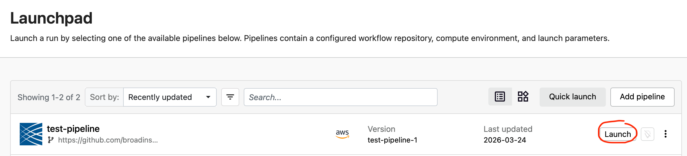
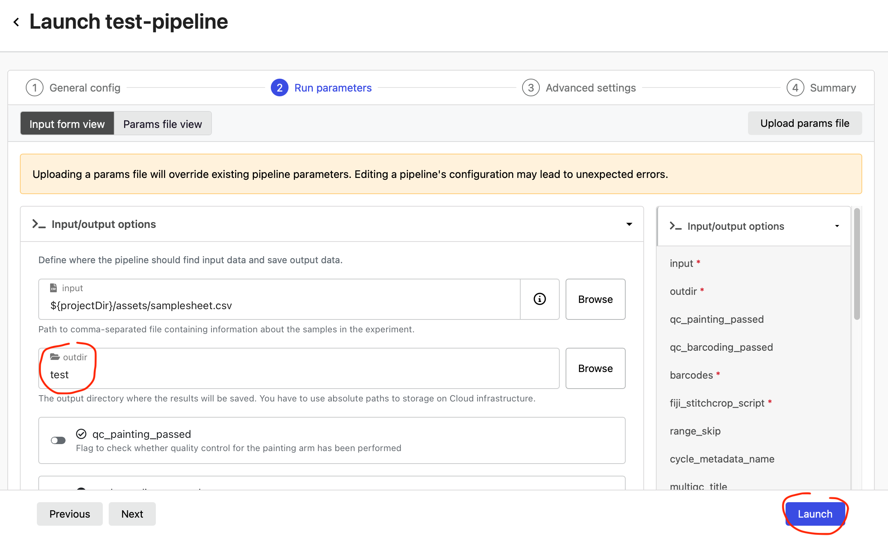
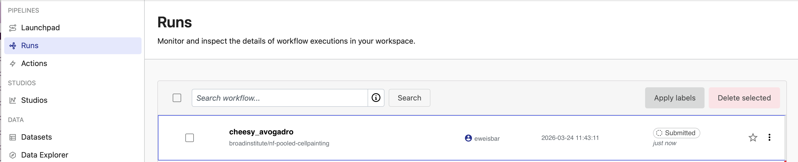
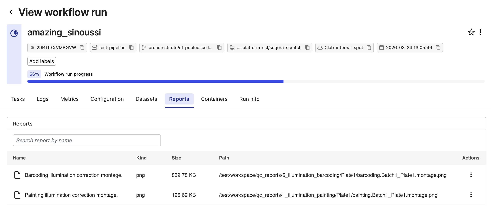
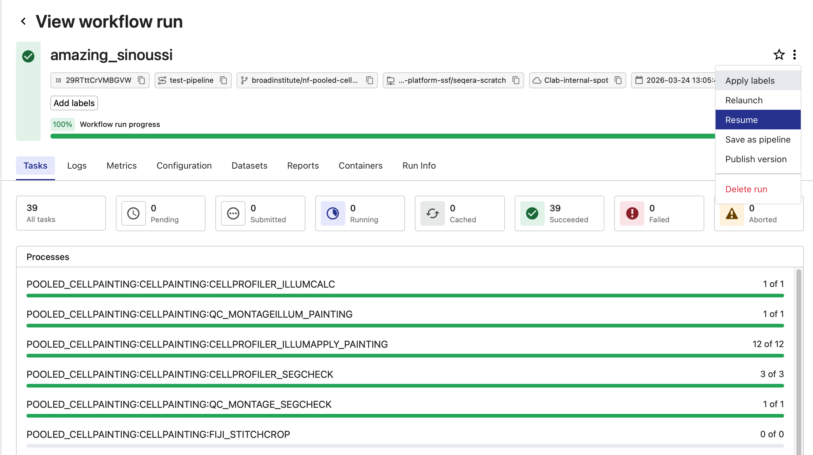
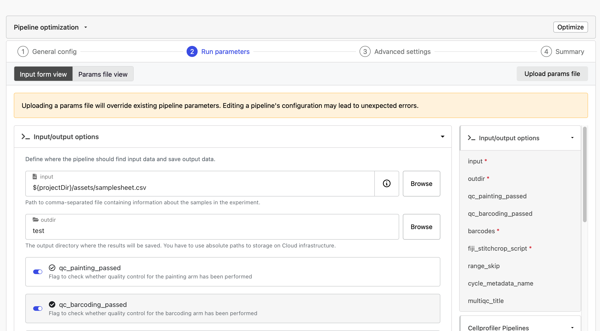

# Quick Start

This walkthrough uses the built-in test profile to demonstrate the complete two-phase workflow. We suggest you start by running the local CLI example. If you will be using Seqera Platform for production runs, proceed to running the test profile there after running the local CLI example.

## Step 1: Run the Test Profile (Phase 1)

The test profile automatically downloads a small dummy dataset containing:

- A minimal subset of images from one well (both Cell Painting and Barcoding arms)
- Pre-configured CellProfiler pipelines
- A sample `Barcodes.csv` file

The pipeline will:

1. Download the test dataset
2. Run illumination calculation and application
3. Run segmentation (Cell Painting) and barcode calling (Barcoding)
4. Generate QC montages
5. **Stop** before stitching (this is expected behavior)

### Local CLI

```bash
nextflow run broadinstitute/nf-pooled-cellpainting \
    -profile test,docker \
    --outdir results
```

Expected runtime: 15-20 minutes locally

### Seqera Platform

In Seqera Platform, on the sidebar select `Launchpad` and then click `Add Pipeline`.

Set the following  variables:

| Setting | Value |
|---------|-------|
| **Name** | `test-pipeline` |
| **Pipeline to launch** | `https://github.com/broadinstitute/nf-pooled-cellpainting` |
| **Revision** | `main` |
| **Compute environment** | Your AWS Batch environment |
| **Work directory** | `s3://your-bucket/prefix/to/scratch/output` |
| **Config profiles** | `test` |

Select `Add`



Next to the newly created `test-pipeline` from the Launchpad select `Launch`.



In the **Run parameters** of the `test-pipeline`, enter an S3 path where your data should be output into `outdir` (e.g. `s3://my-bucket/output-folder/`) and select Launch.



In the Runs view you can see your newly created run. If you click on the run it will show you the status of the workflow modules as they run and complete.

Expected runtime: 5-10 minutes on AWS Batch

## Step 2: Inspect QC Outputs

On real data, you would check for the following QC criteria. Note that the test data is too small to produce meaningful QC, but you can still look at the outputs to see that they are created:

- **Illumination montages**: Smooth, gradual intensity variations (not patchy)
- **Segmentation previews**: Cell/nucleus outlines accurately trace boundaries
- **Alignment reports**: Small, consistent pixel shifts across the field

### Local CLI

Navigate to `results/workspace/qc_reports/` and inspect the contents of the folders:

```text
results/workspace/qc_reports/
├── 1_illumination_painting/
├── 3_segmentation/
├── 5_illumination_barcoding/
├── 6_alignment/
└── 7_preprocessing/
```

### Seqera Platform



Select the **Reports** tab and select each of the individual reports to examine them.

## Step 3: Complete the Run (Phase 2)

Resume with QC flags set to `true`.

### Local CLI

```bash
nextflow run broadinstitute/nf-pooled-cellpainting \
    -profile test,docker \
    --outdir results \
    --qc_painting_passed true \
    --qc_barcoding_passed true \
    -resume
```

:::{admonition} The `-resume` flag is critical

It tells Nextflow to use cached results and only execute new steps. Without it, the pipeline restarts from scratch.
:::

### Seqera Platform



Open the hamburger menu in the upper right and select "Resume".



In the run parameters, toggle the `qc_painting_passed` and `qc_barcoding_passed` on. Select `Launch`.

## Step 4: Explore Final Outputs

After completion, your `results/` directory (either local for a local CLI run or in your S3 bucket for Seqera Platform) contains:

```text
results/
├── images/                    # All processed images by batch/stage
│   └── Batch1/
│       ├── illum/
│       ├── images_corrected/
│       ├── images_corrected_cropped/
│       └── images_corrected_stitched/
├── workspace/
│   ├── analysis/              # Final CSV results (most important!)
│   ├── load_data_csv/         # CellProfiler input files
│   └── qc_reports/            # QC visualizations
├── multiqc/                   # Summary report
└── pipeline_info/             # Execution logs and metrics
```

The most important outputs are in `results/workspace/analysis/`—CSV files containing linked phenotype and genotype data for every cell.